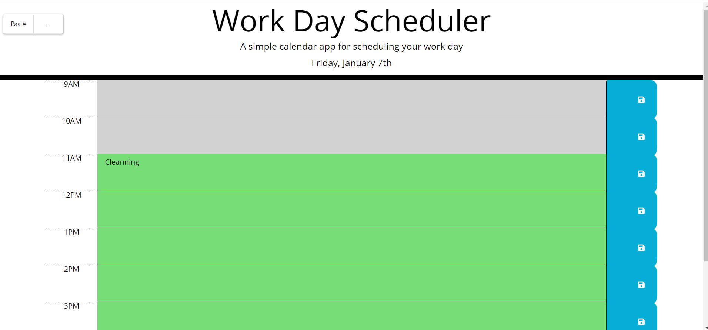

# WorkDay-Planner

## Description

This week's activity was to build a calendar application that allows a user to save events for each hour of the day by modifying starter code. This app will run in the browser and feature dynamically updated HTML and CSS powered by jQuery.
## Usage

   
   

Access deployed application here- https://fauziashafi.github.io/WorkDay-Planner/Develop/